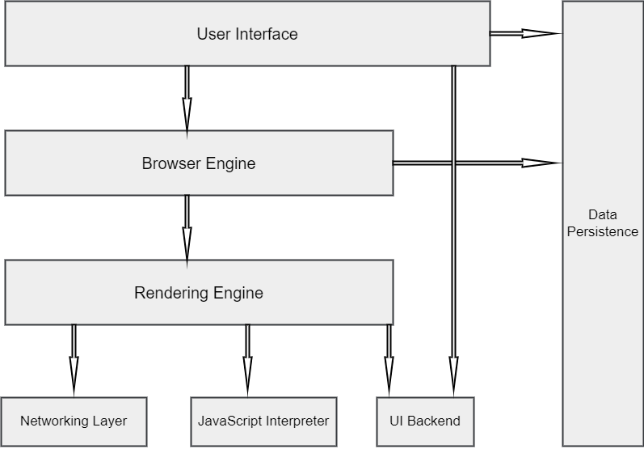
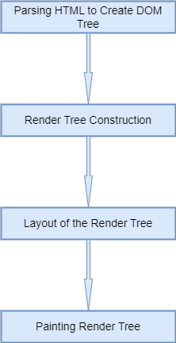

# Assignment 1.1

## When a user enters an URL in the browser, how does the browser fetch the desired result?

---

### Lets first understand what is a browser and what is a URL:

A web browser is a software or a tool that runs on a user computer, mobile, tablet and accesses the information from World Wide Web using URL and internet and displays those information on respective device 'screen.

`In short, a web browser is a gateway to World Wide Web or Digital Information and many more things.` 

An URL is acronym of `Universal Resource Locator`, it is an identifier to locate the unique resource on the internet.

    If Internet is a digital land, URL is an address of a property on that land.

### URL (Ex: https://www.google.com) consist 3 parts
- `Protocol (http or https) -` HTTP stands for Hyper-Text Transfer Protocol and enhanced version is HTTPS where S stands for Secure. Information transmitted over HTTPS are secured.

- `:// -` Colon and two forward Slash is used to separte the protocol from rest of the URL.

- `google.com -` google.com is the domain for the website and .com is Top Level Domain (TLD) extension. There are other type of domain extension such as Country Level Domain extension like .in, .uk, .us etc. Anything that comes after a forword slash after this part is mostly reference to the resources that are inside the directory structure of that website.

## High Level Component of browser and working:

- `User Interface`: User interface is a part of browser with which a user can interact, it contains search bar, action buttons, history etc.

- `Browser Engine`: Browser engine is a bridge using which user interface and rendering engine interacts with each other.

- `Rendering Engine`: Rendering engine renders the web page on browser to display. It can interpret and parse HTML, XML, CSS and executed javascript recieved from Javascript Interpreter.
The rendering engine recievs the requested documents from networking layer, here is the working flow of rendering engine:

    1. Parsing HTML to construct the DOM tree
    2. Render tree construction
    3. Layout of the render tree
    4. Painting the render tree

    The rendering engine will parse the HTML and convert it to DOM Node in a tree like structure, the engine will also parse the style data. Styling information in CSS and visual instruction in HTML will be used together to create another tree in right order i.e. `Render Tree`.
    Once render tree is created, the rendering engine gives each node eaxact coordinates where it should be displayed on the screen, this process is called `Layout Process`. In the next step render tree will be traversed and each node will be painted using `UI Backend` layer.

    

- `Networking`: Networking component is responsible for all kind of comunication over internet using internet protocol like HTTP and maintaining security of data being transmitted.

- `Javascript Interpreter`: This component of browser interprets and executes javascript code. Parser waits for javascript to be executed and after that only parsing starts, in code developer can specify if the script is asynchronous, in that case execution and parsing of javascript will be done by another thread. If javascript is being loaded from third party, interpreter waits for networking layer to download the javascript first.

- `UI Backend`: This part of browser component draws widget and boxes as a generic interface using operting system user interface method

- `Data Persistance`: This is storage component of browser responsible for creating a small database on user's system where browser is installed. The storage is used for managing cookies, cache and settings etc.

